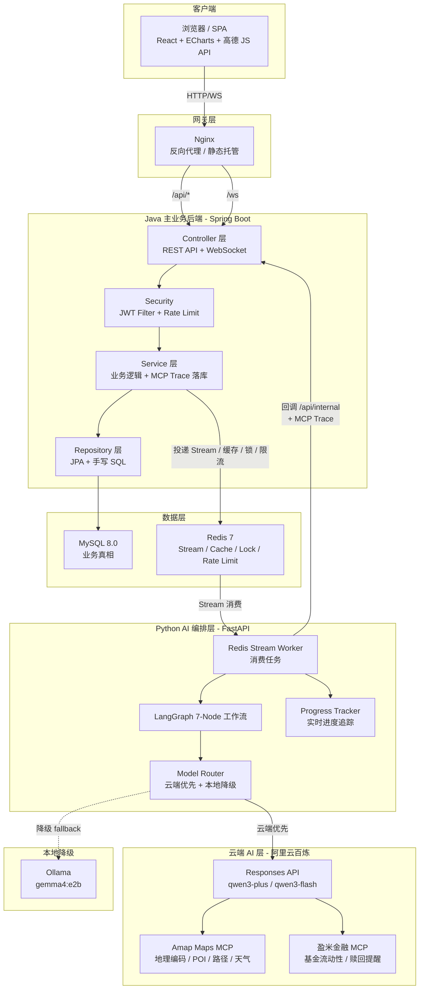
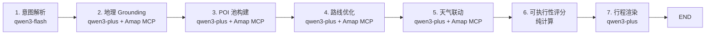
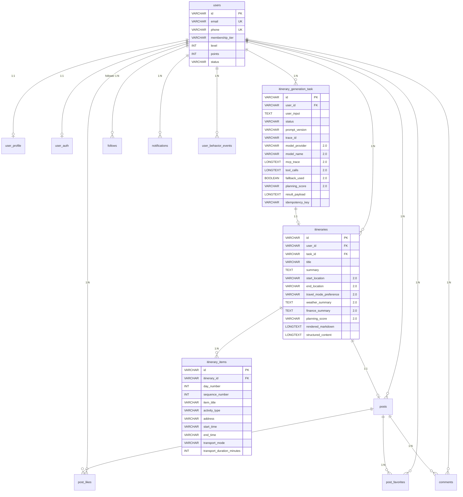
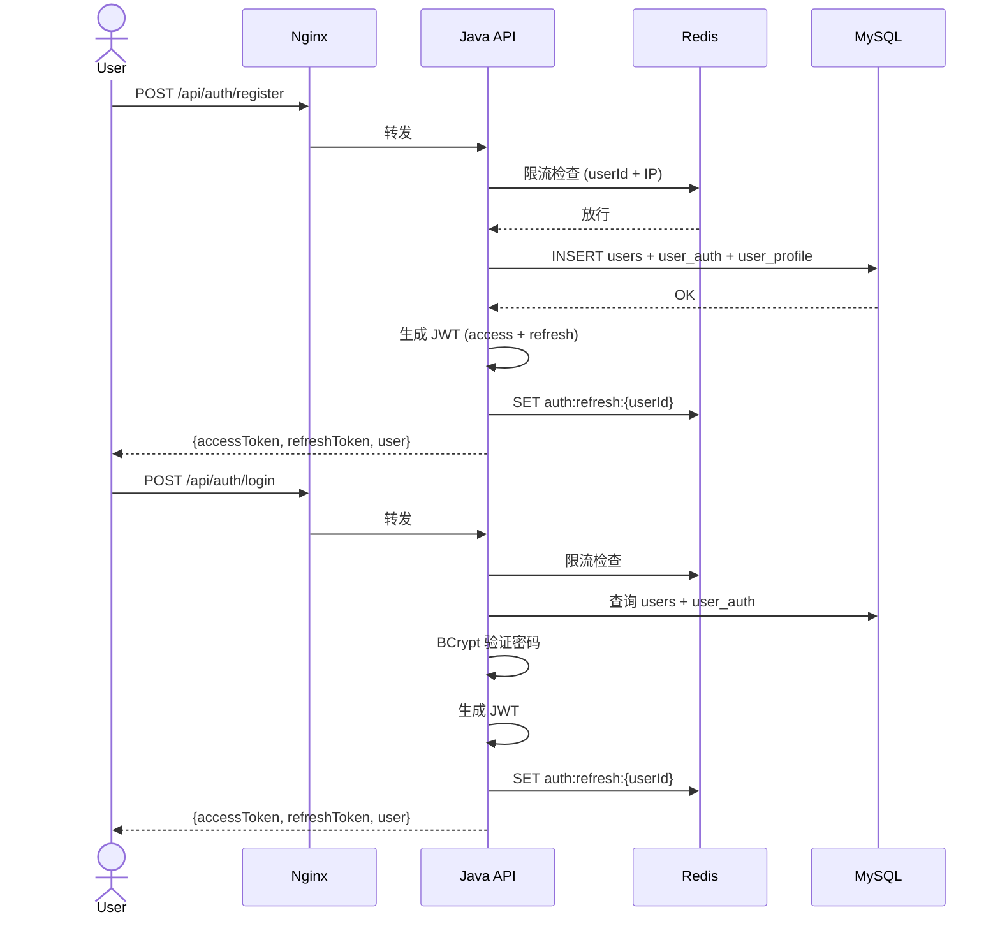
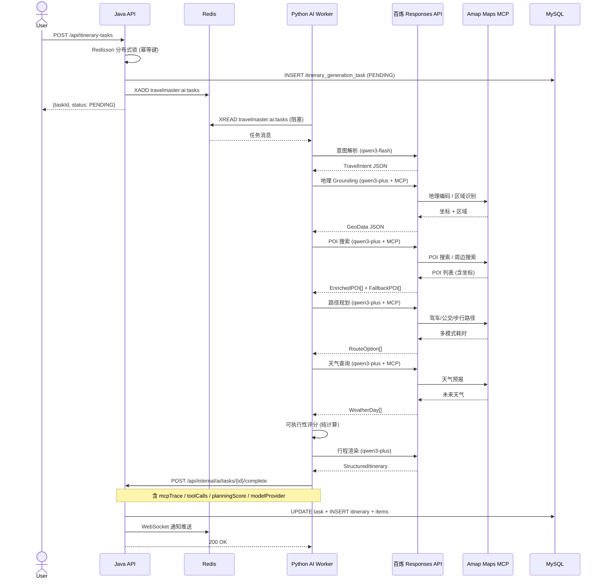
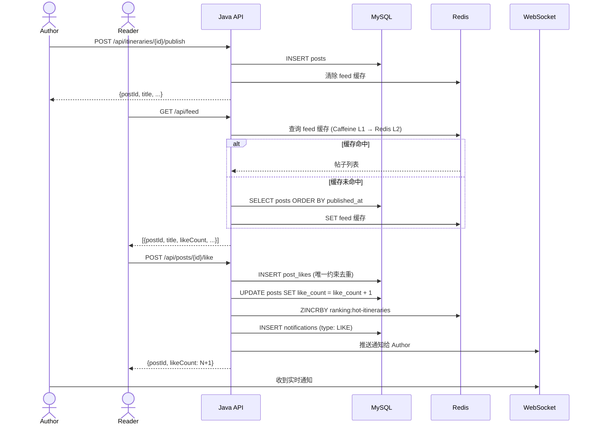
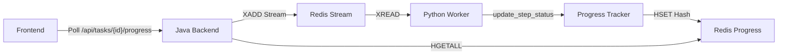

# TravelMaster Pro 2.0 — 架构设计文档

## 1. 分层架构



---

## 2. AI 规划链路（7 段式 LangGraph 工作流）



| 阶段 | 模型 | MCP 工具 | 输出 |
|------|------|----------|------|
| 意图解析 | qwen3-flash | — | TravelIntent (城市/天数/预算/兴趣/交通偏好) |
| 地理 Grounding | qwen3-plus | Amap 地理编码 | 城市中心坐标、核心区域、出发/结束点 |
| POI 池构建 | qwen3-plus | Amap POI/周边搜索 | EnrichedPOI[] (带坐标) + FallbackPOI[] |
| 路线优化 | qwen3-plus | Amap 路径规划 | RouteOption[] (驾车/公交/步行比选) |
| 天气联动 | qwen3-plus | Amap 天气查询 | WeatherDay[] + 雨天室内切换 |
| 可执行性评分 | 纯计算 | — | PlanningScore (轻松/适中/紧凑/不可执行) |
| 行程渲染 | qwen3-plus | — | StructuredItinerary (days/poi/transport/weather) |

### 模型降级策略

```
云端首选 ─────────────────────────────────
  │  qwen3-plus (主推理)
  │  qwen3-flash (轻量抽取)
  │
  ▼  超时 / 异常 / API Key 未配置
本地降级 ─────────────────────────────────
  │  Ollama gemma4:e2b
  │  (无 MCP，纯文本推理)
  ▼
```

---

## 3. ER 图



---

## 4. 核心时序图

### 4.1 注册 → 登录 → JWT



### 4.2 行程任务 → Redis Stream → 百炼 MCP 规划 → 回调



### 4.3 发布帖子 → 点赞 → 通知



---

## 5. MCP 工具链

### 5.1 高德地图 MCP（Amap Maps）

通过百炼 Responses API 挂载，SSE 协议接入。

| 工具能力 | 用途 | 规划阶段 |
|---------|------|---------|
| 地理编码 | 地址 → 坐标 | Stage 2 Geo Grounding |
| 逆地理编码 | 坐标 → 地址 | Stage 2 |
| POI 搜索 | 关键字搜索景点 | Stage 3 POI Pool |
| 周边搜索 | 附近餐厅/设施 | Stage 3 |
| 路径规划 (驾车) | 驾车耗时 | Stage 4 Route |
| 路径规划 (公交) | 公交耗时 | Stage 4 |
| 路径规划 (步行) | 步行耗时 | Stage 4 |
| 天气查询 | 未来天气预报 | Stage 5 Weather |

### 5.2 盈米金融 MCP（Yingmi Finance）

| 工具能力 | 用途 |
|---------|------|
| 基金流动性查询 | T+0 / T+1 / T+N 赎回时效 |
| 赎回时点提醒 | 假期前赎回截止日 |
| 低风险产品分类 | 现金管理候选 |
| 资金规划辅助 | 旅行预算 vs 资产配置 |

> ⚠️ 合规边界：仅信息展示，不构成投资建议，不直接做申购/赎回。

---

## 6. 索引设计

| 表 | 索引 | 用途 |
|----|------|------|
| `users` | `UNIQUE(email)`, `UNIQUE(phone)` | 登录查询、唯一约束 |
| `user_profile` | `UNIQUE(user_id)` | 1:1 关联 |
| `user_auth` | `UNIQUE(user_id)` | 1:1 关联 |
| `itinerary_generation_task` | `(status, created_at)`, `(user_id, created_at)` | 任务列表分页 |
| `itinerary_generation_task` | `(model_provider)`, `(planning_score)` | 模型分布分析 |
| `itineraries` | `(user_id, created_at)` | 用户行程列表 |
| `posts` | `(published_at)` | Feed 时间线分页 |
| `post_likes` | `UNIQUE(post_id, user_id)` | 防重复点赞 |
| `post_favorites` | `UNIQUE(post_id, user_id)` | 防重复收藏 |
| `comments` | `(post_id, created_at)` | 帖子评论列表 |
| `follows` | `UNIQUE(follower_id, followee_id)` | 防重复关注 |
| `notifications` | `(user_id, read_status, created_at)` | 未读通知查询 |
| `user_behavior_events` | `(event_type, created_at)` | 行为分析 |

---

## 7. 数据库迁移策略

### Flyway 版本化迁移

| 版本 | 文件名 | 说明 |
|------|--------|------|
| V1 | `V1__initial_schema.sql` | 初始数据库结构（用户、行程、社交等） |
| V2 | `V2__add_mcp_trace.sql` | 添加 MCP Trace 字段（2.0 架构升级） |
| V3 | `V3__add_footprint_table.sql` | 添加足迹地图表 |
| V4 | `V4__fix_cascade_delete.sql` | 修复外键约束，添加 ON DELETE CASCADE |

### 级联删除策略

**问题**：删除帖子时，因 `post_likes`、`post_favorites`、`comments` 表的外键约束导致删除失败。

**解决**：修改外键为 `ON DELETE CASCADE`，自动清理关联数据。

```sql
-- post_likes 表
ALTER TABLE post_likes 
    ADD CONSTRAINT fk_post_like_post 
    FOREIGN KEY (post_id) REFERENCES posts(id) ON DELETE CASCADE;

-- post_favorites 表
ALTER TABLE post_favorites 
    ADD CONSTRAINT fk_post_favorite_post 
    FOREIGN KEY (post_id) REFERENCES posts(id) ON DELETE CASCADE;

-- comments 表
ALTER TABLE comments 
    ADD CONSTRAINT fk_comment_post 
    FOREIGN KEY (post_id) REFERENCES posts(id) ON DELETE CASCADE;
```

---

## 8. 缓存策略

```
┌─────────────────────────────────────────────┐
│  请求 → Caffeine (JVM L1, 5min TTL, 1000)  │
│     ↓ miss                                  │
│  Redis (L2, 30min TTL)                      │
│     ↓ miss                                  │
│  MySQL                                      │
│     ↓ 结果回写 L1 + L2                      │
└─────────────────────────────────────────────┘

失效策略：领域事件触发
- 点赞/收藏 → 清除帖子详情缓存 + 榜单缓存
- 发布帖子 → 清除 feed 缓存
- 关注 → 清除创作者榜缓存
```

---

## 9. 限流策略

| 接口 | 维度 | 限制 |
|------|------|------|
| 注册 | 邮箱 + IP | 10 次/分钟 (邮箱), 30 次/分钟 (IP) |
| 登录 | 账号 + IP | 20 次/分钟 (账号), 60 次/分钟 (IP) |
| 创建任务 | userId | Redisson 分布式锁 + 幂等键 |
| 点赞/收藏 | userId + postId | 唯一约束去重 |

---

## 10. 可观测性

所有 MCP 调用落 trace，便于面试展示：

| 字段 | 存储位置 | 说明 |
|------|---------|------|
| `model_provider` | itinerary_generation_task | 实际使用的模型 (qwen3-plus / ollama) |
| `mcp_trace` | itinerary_generation_task | 每个 MCP 工具调用的详细记录 |
| `tool_calls` | itinerary_generation_task | 工具调用链 JSON |
| `fallback_used` | itinerary_generation_task | 是否降级到本地模型 |
| `planning_score` | itinerary_generation_task / itineraries | 可执行性评分 |

### 评测维度 (itinerary_evaluator)

| 维度 | 满分 | 说明 |
|------|------|------|
| POI 覆盖率 | 20 | 有坐标的 POI 占比 |
| 交通可行性 | 20 | 平均交通时间合理性 |
| 天气适配度 | 20 | 天气数据完整性 |
| 每日均衡度 | 20 | 每天活动分布方差 |
| MCP 真实率 | 20 | 来自高德 MCP 的 POI 比例 |

---

## 11. Redis Stream 任务队列优化

### 消息堆积问题

**现象**：Worker 重复处理历史任务，即使用户未提交新请求。

**根本原因**：
- Worker 使用 `xread` 从 Stream 开头读取（`last_id = '0'`）
- 重启后会重新消费所有历史消息

**解决方案**：
```python
# ❌ 旧配置：从开头读取
last_id = '0'

# ✅ 新配置：从最新消息开始
last_id = '$'
```

### 清理工具

提供 `clean_redis_stream.py` 脚本用于手动清理堆积消息：

```bash
python clean_redis_stream.py
```

---

## 12. 实时进度追踪

### 架构设计



### 进度数据结构

```json
{
  "taskId": "965901f1-a669-48ab-941e-c9456b09e61f",
  "overallProgress": 37,
  "currentStep": "poi_selector",
  "steps": [
    {"id": "intent_parser", "name": "意图解析", "status": "completed", "progress": 100},
    {"id": "geo_grounder", "name": "地理校准", "status": "completed", "progress": 100},
    {"id": "poi_selector", "name": "POI筛选", "status": "processing", "progress": 50},
    {"id": "route_optimizer", "name": "路线优化", "status": "pending", "progress": 0},
    {"id": "weather_adjuster", "name": "天气联动", "status": "pending", "progress": 0},
    {"id": "scoring", "name": "可执行性评分", "status": "pending", "progress": 0},
    {"id": "renderer", "name": "行程渲染", "status": "pending", "progress": 0},
    {"id": "finance_advisor", "name": "资金规划", "status": "pending", "progress": 0}
  ]
}
```

### 日志级别优化

**问题**：进度更新日志被隐藏，无法调试。

**解决**：
1. Uvicorn 日志级别设置为 `info`（而非 `warning`）
2. Progress Tracker 使用 `logger.info()`（而非 `logger.debug()`）
3. 关闭 HTTP 访问日志（`access_log=False`）减少噪音

```python
# main.py
uvicorn.run(
    "main:app",
    log_level="info",      # ✅ 显示 info 级别日志
    access_log=False       # ✅ 关闭访问日志
)

# progress_tracker.py
logger.info(f"[PROGRESS UPDATE] Task {task_id}, Step {step_id} -> {status}")
logger.info(f"[PROGRESS UPDATED] Task {task_id}: {overall_progress}% complete")
```

---

## 13. Java WebClient 错误处理优化

### 404 错误优雅处理

**问题**：Python 服务返回 404 时，Java 后端抛出异常并记录错误日志。

**解决**：使用 `WebClient.onStatus()` 优雅处理 4xx 错误。

```java
Map<String, Object> progressData = pythonWebClient.get()
    .uri("/api/v1/tasks/{taskId}/progress", taskId)
    .retrieve()
    // ✅ 优雅处理 4xx 客户端错误
    .onStatus(
        HttpStatusCode::is4xxClientError,
        response -> Mono.empty()  // 返回空值而非抛异常
    )
    .bodyToMono(Map.class)
    .block(Duration.ofSeconds(2));
```

---

## 14. 前端自动计算功能

### 旅行天数联动计算

**需求**：根据开始日期和结束日期自动计算旅行天数。

**实现**：
```typescript
useEffect(() => {
  if (startDate && endDate) {
    const start = new Date(startDate);
    const end = new Date(endDate);
    
    // 计算两个日期之间的天数差（包含首尾两天）
    const diffTime = end.getTime() - start.getTime();
    const diffDays = Math.ceil(diffTime / (1000 * 60 * 60 * 24)) + 1;
    
    // 确保天数在合理范围内（1-15天）
    if (diffDays >= 1 && diffDays <= 15) {
      setDays(diffDays);
    }
  }
}, [startDate, endDate]);
```

**计算公式**：
- `end.getTime() - start.getTime()`：获取毫秒差
- `/ (1000 * 60 * 60 * 24)`：转换为天数（86400000 毫秒 = 1 天）
- `Math.ceil()`：向上取整，处理浮点数精度问题
- `+1`：包含首尾两天（例如 4/29 到 4/29 是 1 天，不是 0 天）
