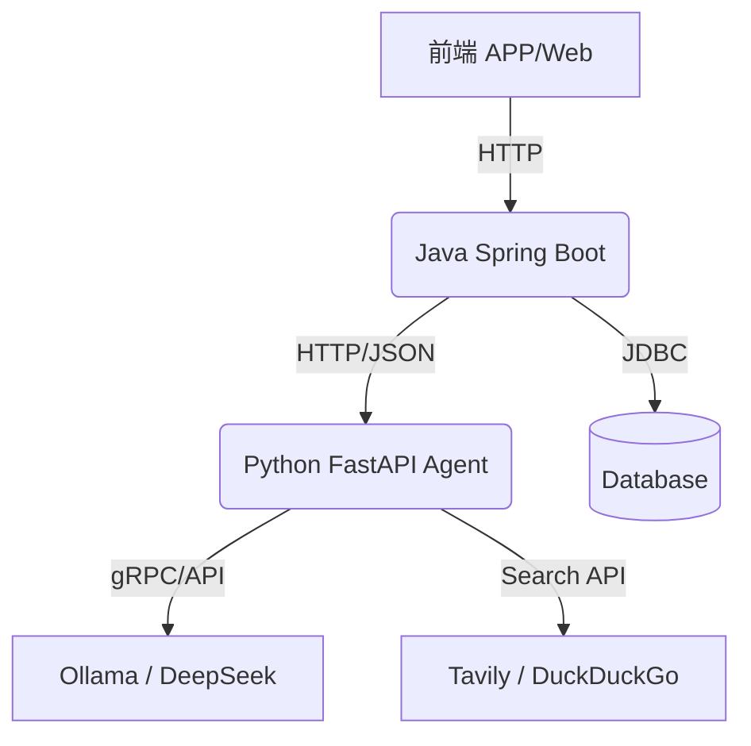

# TravelMaster 项目部署与技术白皮书

## 1. 架构概述
TravelMaster 采用现代化的微服务架构，旨在通过多 Agent 协作提供智能化的旅游规划服务。系统分为前端展示层、Java 业务网关层、Python Agent 核心层以及底层 LLM/工具层。

### 1.1 技术栈选型
- **前端**: Streamlit / React (负责可视化与交互)
- **后端网关**: Java Spring Boot 3 (负责业务逻辑、认证与持久化)
- **Agent 核心**: Python FastAPI + LangGraph (负责 AI 推理与工作流编排)
- **数据库**: SQLite / PostgreSQL (数据持久化)
- **模型**: Ollama (Gemma 4) + DeepSeek API (云端回退)

## 2. 微服务边界与通信
### 2.1 通信协议
各服务间采用 **RESTful API (HTTP/JSON)** 进行同步通信。
- **Java -> Python**: `POST /api/v1/plan`
- **Frontend -> Java**: `POST /api/travel/itinerary`

### 2.2 数据流转逻辑
1. 用户在前端输入旅行需求。
2. Java 后端接收请求，校验用户身份并记录日志。
3. Java 通过 `WebClient` 异步调用 Python Agent 服务。
4. Python 服务执行 LangGraph 工作流（Planner -> Researcher -> Validator -> Generator）。
5. Python 返回结构化行程单，Java 将其存入数据库并响应前端。

## 3. 部署拓扑

## 4. 故障恢复与扩展性
- **Fallback 机制**: Python 服务内置模型回退逻辑，本地 Ollama 不可用时自动切换至 DeepSeek。
- **水平扩展**: Python Agent 服务无状态设计，可通过增加实例数应对高并发规划请求。
- **健康检查**: 提供 `/health` 接口供 Kubernetes 或负载均衡器监控服务状态。

## 5. 快速开始
1. **启动 Python 服务**: `python server.py`
2. **启动 Java 后端**: `mvn spring-boot:run`
3. **访问前端**: `streamlit run ui/app.py`
