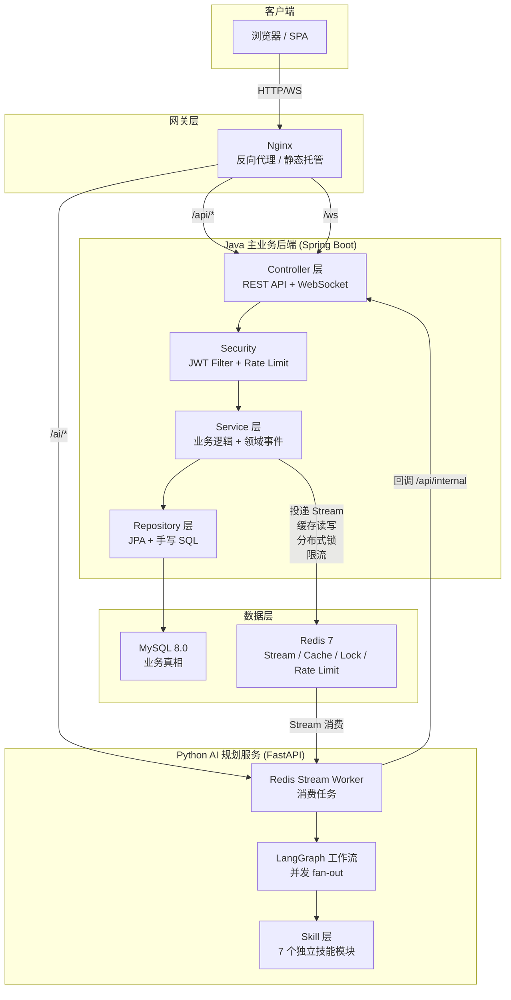
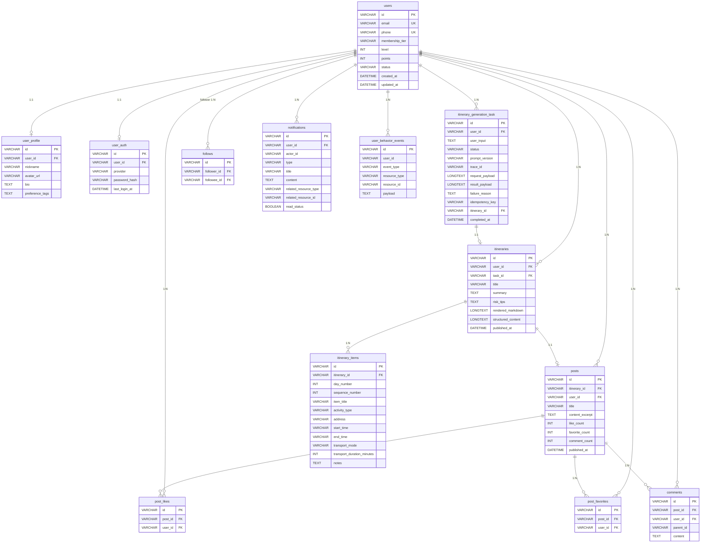
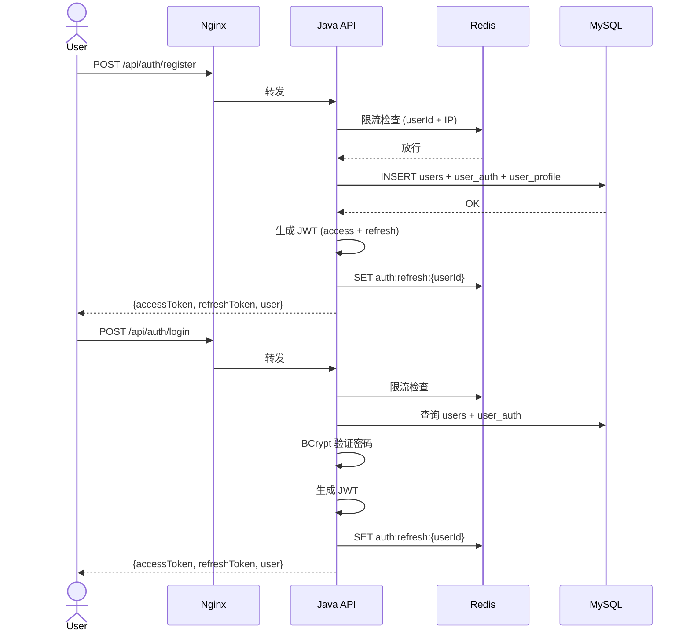
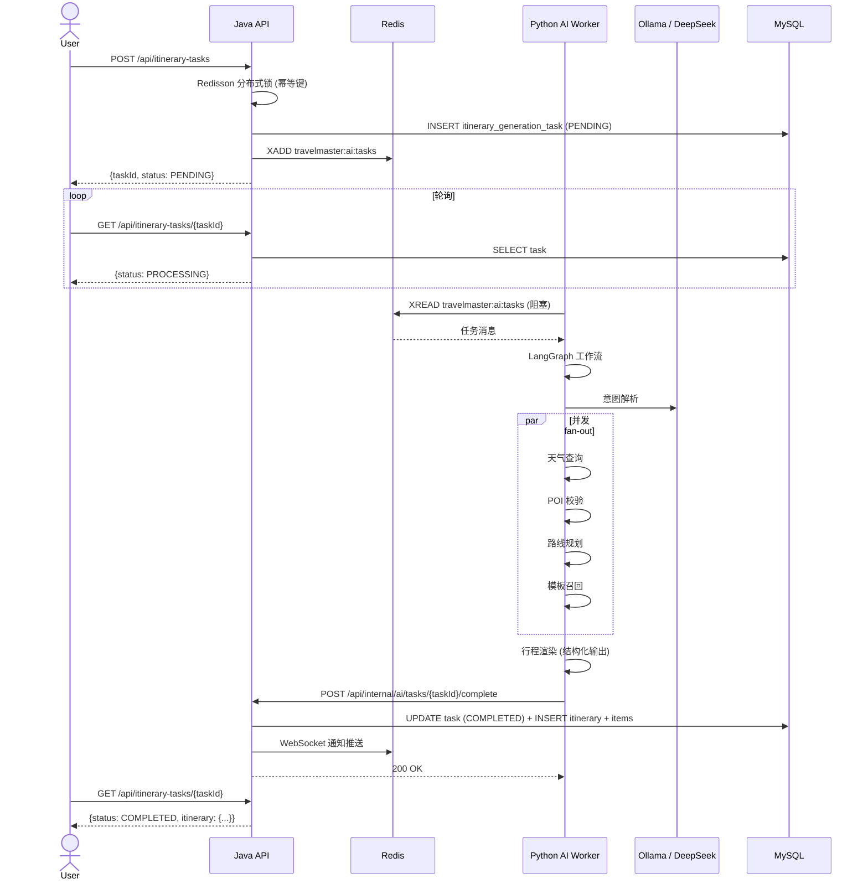
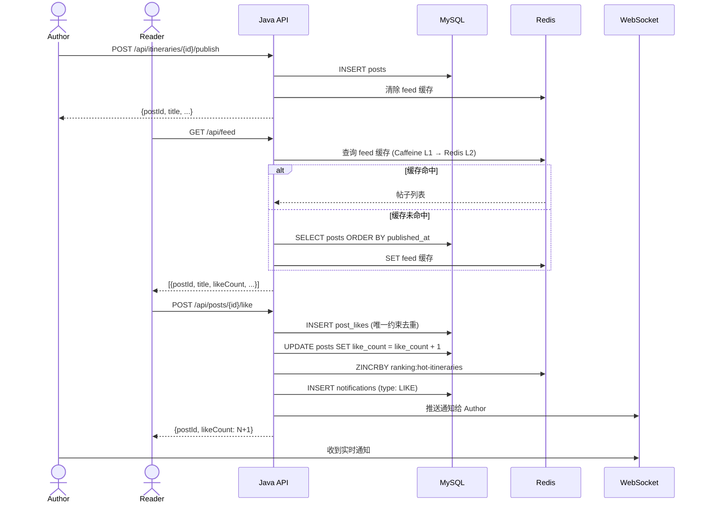

# TravelMaster Pro — 架构设计文档

## 1. 分层架构



---

## 2. ER 图



---

## 3. 核心时序图

### 3.1 注册 → 登录 → JWT



### 3.2 行程任务 → Redis Stream → AI 规划 → 回调



### 3.3 发布帖子 → 点赞 → 通知



---

## 4. 索引设计

| 表 | 索引 | 用途 |
|----|------|------|
| `users` | `UNIQUE(email)`, `UNIQUE(phone)` | 登录查询、唯一约束 |
| `user_profile` | `UNIQUE(user_id)` | 1:1 关联 |
| `user_auth` | `UNIQUE(user_id)` | 1:1 关联 |
| `itinerary_generation_task` | `(status, created_at)`, `(user_id, created_at)` | 任务列表分页、状态轮询 |
| `itineraries` | `(user_id, created_at)` | 用户行程列表 |
| `posts` | `(published_at)` | Feed 时间线分页 |
| `post_likes` | `UNIQUE(post_id, user_id)` | 防重复点赞 |
| `post_favorites` | `UNIQUE(post_id, user_id)` | 防重复收藏 |
| `comments` | `(post_id, created_at)` | 帖子评论列表 |
| `follows` | `UNIQUE(follower_id, followee_id)` | 防重复关注 |
| `notifications` | `(user_id, read_status, created_at)` | 未读通知查询 |
| `user_behavior_events` | `(event_type, created_at)` | 行为分析时间范围查询 |

---

## 5. 缓存策略

```
┌─────────────────────────────────────────────┐
│  请求 → Caffeine (JVM L1, 5min TTL, 1000)  │
│     ↓ miss                                  │
│  Redis (L2, 30min TTL)                      │
│     ↓ miss                                  │
│  MySQL                                      │
│     ↓ 结果回写 L1 + L2                      │
└─────────────────────────────────────────────┘

失效策略：领域事件触发
- 点赞/收藏 → 清除帖子详情缓存 + 榜单缓存
- 发布帖子 → 清除 feed 缓存
- 关注 → 清除创作者榜缓存
```

---

## 6. 限流策略

| 接口 | 维度 | 限制 |
|------|------|------|
| 注册 | 邮箱 + IP | 10 次/分钟 (邮箱), 30 次/分钟 (IP) |
| 登录 | 账号 + IP | 20 次/分钟 (账号), 60 次/分钟 (IP) |
| 创建任务 | userId | Redisson 分布式锁 + 幂等键 |
| 点赞/收藏 | userId + postId | 唯一约束去重 |
