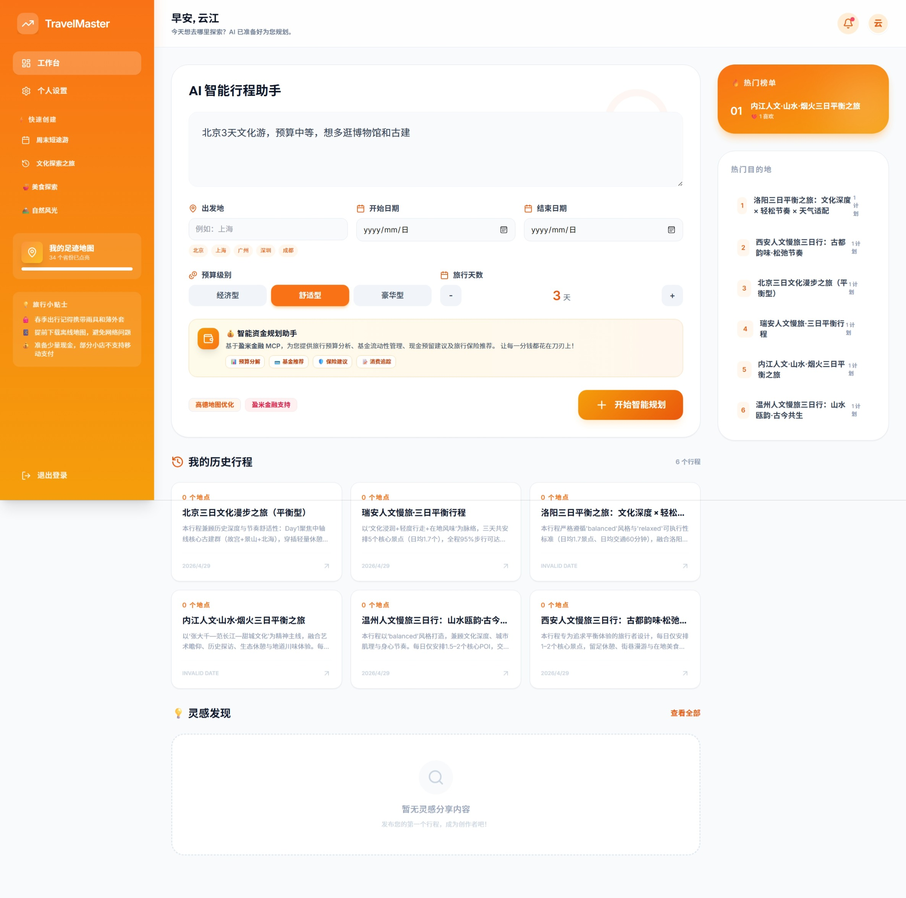
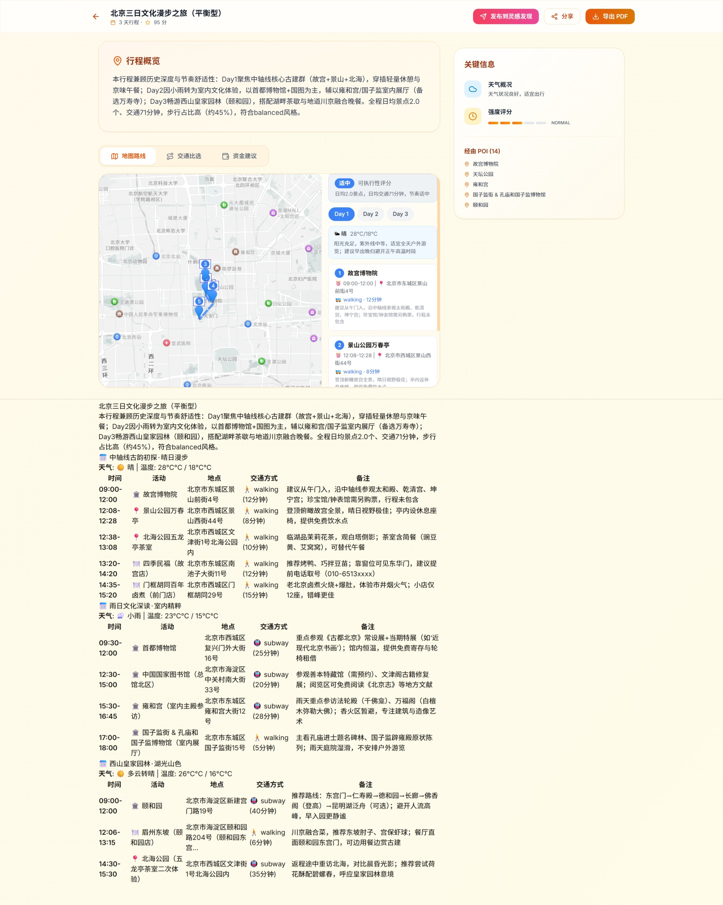

# TravelMaster Pro 2.0

> 基于 **Java Spring Boot + Python FastAPI + 阿里云百炼 MCP** 的智能旅游社交平台。
> 定位：云端 AI 驱动的高并发旅游社交平台 —— 真实地理约束下的动态行程规划。

---

## 📸 项目展示

### 主页界面


### AI 行程规划


---

## 技术栈

| 层次 | 技术 |
|------|------|
| **Java 后端** | Spring Boot 3.2 · Spring Security · Spring Data JPA · Flyway · WebSocket (STOMP) |
| **Python AI 编排** | FastAPI · LangGraph (7-Node) · 阿里云百炼 Responses API · MCP |
| **云端模型** | qwen3-plus (主推理) · qwen3-flash (轻量抽取) |
| **本地降级** | Ollama gemma4:e2b |
| **MCP 工具** | 高德地图 MCP (地理编码/POI/路径/天气) · 盈米金融 MCP (资金规划) |
| **数据** | MySQL 8.0 · Redis 7 (Stream / Cache / Rate Limit / Distributed Lock) |
| **缓存** | Caffeine (L1) + Redis (L2) 两级缓存 |
| **分布式** | Redisson 分布式锁 · Redis Stream 异步任务 |
| **前端** | React 19 · TypeScript · Vite · ECharts · 高德 JS API · Axios |
| **基础设施** | Docker Compose · Nginx · k6 压测 |
| **测试** | JUnit 5 · Mockito · MockMvc · pytest · pytest-asyncio |

---

## 架构概览

```
┌──────────┐     ┌──────────────┐     ┌──────────────┐
│  Nginx   │────▶│  Java API    │────▶│    MySQL     │
│ (80)     │     │ (8080)       │     │  (3306)      │
└──────────┘     └──────┬───────┘     └──────────────┘
     │                  │
     │            ┌─────▼─────┐
     │            │   Redis   │◀─── Stream / Cache / Lock
     │            │  (6379)   │
     │            └─────┬─────┘
     │                  │  Redis Stream
     │            ┌─────▼─────────────┐
     └───────────▶│  Python AI Worker │
                  │  (8000)           │
                  └─────┬─────────────┘
                        │  Responses API + MCP
                  ┌─────▼─────────────┐
                  │  阿里云百炼        │
                  │  qwen3-plus/flash │
                  │  + Amap MCP       │
                  │  + 盈米金融 MCP   │
                  └───────────────────┘
```

**数据流**：
1. 用户通过 Nginx 访问前端 SPA 或调用 `/api/*` 接口
2. Java 后端处理认证、社交、通知等核心业务，数据写入 MySQL
3. 行程生成请求：Java 写入 `itinerary_generation_task` 表，投递 Redis Stream
4. Python AI Worker 从 Redis Stream 消费，调用百炼 Responses API + MCP 工具
5. **7 段式规划**：意图解析 → 地理 Grounding → POI 池 → 路线优化 → 天气联动 → 评分 → 渲染
6. 生成完成后 Python 回调 Java 内部接口（含 MCP Trace），Java 落库并推送 WebSocket 通知
7. 前端通过高德 JS API 展示地图行程、路线比选、天气卡片

---

## 核心模块

| 模块 | 职责 | 关键技术点 |
|------|------|-----------|
| `auth` | 注册/登录/刷新 Token | JWT · BCrypt · Redis 限流 · Refresh Token 轮转 |
| `user` | 用户资料管理 | JPA · 偏好标签 |
| `itinerary` | 行程生成任务 | Redis Stream · 幂等键 · Redisson 分布式锁 · 异步回调 |
| `social` | 帖子/点赞/收藏/评论/关注 | MySQL 写 + Redis 热计数 · 领域事件触发缓存失效 |
| `notification` | 通知系统 | WebSocket (STOMP) · Redis Stream |
| `ranking` | 排行榜 | Redis Sorted Set · Caffeine + Redis 两级缓存 |
| `analytics` | 运营报表 | 聚合 SQL · 转化漏斗 · 目的地统计 |
| `ai-planner` | AI 行程规划 (Python) | 百炼 qwen3 · Amap MCP · 盈米 MCP · 9 段式 LangGraph · 进度追踪 |
| `footprint` | 足迹地图 | ECharts 省级地图 · 34 个省级行政区 · 自动联动计算 |

---

## AI 规划 — 9 段式工作流

| 阶段 | 模型 | MCP 工具 | 输出 |
|------|------|----------|------|
| 1. 意图解析 | qwen3-flash | — | 城市/天数/预算/兴趣/交通偏好 |
| 2. 地理 Grounding | qwen3-plus | Amap 地理编码 | 城市中心坐标、核心区域 |
| 3. POI 池构建 | qwen3-plus | Amap POI/周边搜索 | 分类 POI (景点/餐饮/备选) |
| 4. 路线优化 | qwen3-plus | Amap 路径规划 | 多交通方式比选 |
| 5. 天气联动 | qwen3-plus | Amap 天气 | 天气预报 + 室内/外切换 |
| 6. 可执行性评分 | 纯计算 | — | 轻松/适中/紧凑/不可执行 |
| 7. 资金建议 | qwen3-plus | 盈米金融 MCP | 预算分析 + 流动性提醒 |
| 8. 大交通规划 | qwen3-plus | — | 往返交通方案（飞机/火车） |
| 9. 行程渲染 | qwen3-plus | — | 结构化 JSON + Markdown |

### 模型降级策略

- **云端首选**：百炼 qwen3-plus (主推理) / qwen3-flash (轻量抽取)
- **本地降级**：Ollama gemma4:e2b（无 MCP，纯文本推理）
- **降级触发**：API Key 未配置 / 云端超时 / 异常

### Token 消耗优化

为降低 API Token 消耗，采用了以下优化策略：

| 优化项 | 优化前 | 优化后 | 效果 |
|--------|--------|--------|------|
| **前端轮询间隔** | 固定 2 秒 | 初始 5 秒，指数退避（最大 30 秒） | 轮询次数减少约 **60%** |
| **LLM 重试次数** | 3 次 | 2 次 | 重试次数减少 **33%** |
| **LLM 重试间隔** | 2 秒 | 5 秒 | 减少无效等待 |
| **429 限流等待** | 5 秒 | 10 秒 | 更好应对限流 |

**指数退避公式**：`delay = min(delay * 1.5, 30000)`

**Token 消耗预估**：

| 场景 | 优化前 | 优化后 | 节省比例 |
|------|--------|--------|----------|
| 单次行程（无重试） | 7-8 次 | 7-8 次 | - |
| 单次行程（含重试） | 14-24 次 | 9-16 次 | ~35% |
| 30 秒任务处理轮询 | ~15 次 | ~5-6 次 | ~65% |

---

## 旅行资金安排助手

基于盈米金融 MCP 的旅行资金规划辅助功能：

| 输出内容 | 说明 |
|---------|------|
| 预算分析 | 总预算、日均消费、预算级别 |
| 现金预留建议 | 推荐预留金额 + 应急金 |
| 赎回时点提醒 | T+0/T+1/T+N 流动性提醒 |
| 风险提示 | 免责声明（不构成投资建议） |

---

## 足迹地图

基于 ECharts 的中国省级行政区可视化地图：

| 特性 | 说明 |
|------|------|
| **省级地图** | 覆盖 34 个省级行政区（含特别行政区） |
| **自动联动** | 开始/结束日期变化时，天数自动计算（包含首尾两天） |
| **多数据源容错** | 尝试阿里云 DataV v3/v2 API，加载失败显示友好提示 |
| **降级策略** | 即使地图加载失败，仍可使用右侧省份列表手动标记 |
| **实时交互** | 点击省份切换访问状态，支持搜索过滤 |

---

## 快速开始

### 环境要求

- Docker Desktop（含 Docker Compose）
- 可选：JDK 21 + Maven 3.9（本地开发）
- 可选：Python 3.12+（本地开发）
- 可选：Node.js 20+（前端开发）

### 环境变量

```bash
# .env 必填
DASHSCOPE_API_KEY=your_bailian_api_key
AMAP_API_KEY=your_amap_web_service_key
AMAP_MCP_URL=https://your-amap-mcp-endpoint/sse   # 百炼 MCP 市场获取
YINGMI_MCP_URL=https://your-yingmi-mcp-endpoint/sse
YINGMI_API_KEY=your_yingmi_api_key
```

### 一键启动

```bash
git clone <repo-url> && cd TravelMaster
cp .env.example .env  # 填入上述 API Key
docker-compose up --build

# 访问
# 前端:  http://localhost
# API:   http://localhost/api
# AI:    http://localhost/ai/docs
```

### 本地开发

```bash
# 1. 启动依赖
docker-compose up mysql redis -d

# 2. Java 后端
cd travel-master-backend && mvn spring-boot:run

# 3. Python AI
cd .. && pip install -r requirements.txt && python main.py

# 4. 前端
cd travel-master-frontend && npm install && npm run dev
```

---

## API 列表

### 认证
| Method | Path | 说明 |
|--------|------|------|
| POST | `/api/auth/register` | 注册 |
| POST | `/api/auth/login` | 登录 |
| POST | `/api/auth/refresh` | 刷新 Token |

### 行程任务
| Method | Path | 说明 |
|--------|------|------|
| POST | `/api/itinerary-tasks` | 创建 AI 行程生成任务 |
| GET | `/api/itinerary-tasks/{taskId}` | 查询任务状态与结果 |

### 社交
| Method | Path | 说明 |
|--------|------|------|
| POST | `/api/itineraries/{id}/publish` | 发布行程为帖子 |
| GET | `/api/feed` | 获取社交 Feed |
| POST | `/api/posts/{id}/like` | 点赞/取消点赞 |
| POST | `/api/posts/{id}/favorite` | 收藏/取消收藏 |
| POST | `/api/posts/{id}/comments` | 发表评论 |
| POST | `/api/users/{id}/follow` | 关注/取消关注 |

### 通知 & 排行榜
| Method | Path | 说明 |
|--------|------|------|
| GET | `/api/notifications` | 获取通知列表 |
| GET | `/api/rankings/hot-itineraries` | 热门行程榜 |
| GET | `/api/rankings/creators` | 优质创作者榜 |
| GET | `/api/analytics/overview` | 运营概览 |

---

## 测试

```bash
# Java 单元测试 + 集成测试 (35 tests)
cd travel-master-backend && mvn test

# Python 测试
python -m pytest src/tests -q

# k6 压测（需安装 k6）
k6 run load-test/login-stress.js
k6 run load-test/feed-interaction.js
k6 run load-test/task-submit.js
```

---

## 项目结构

```
TravelMaster/
├── travel-master-backend/       # Java Spring Boot 主后端
│   ├── src/main/java/com/travelmaster/
│   │   ├── auth/                # 认证模块
│   │   ├── user/                # 用户模块
│   │   ├── itinerary/           # 行程任务模块 (含 2.0 MCP Trace)
│   │   ├── social/              # 社交模块
│   │   ├── notification/        # 通知模块
│   │   ├── ranking/             # 排行榜模块
│   │   ├── analytics/           # 运营分析模块
│   │   ├── ai/                  # AI 任务发布 (Redis Stream)
│   │   ├── security/            # JWT 认证过滤器
│   │   ├── config/              # 全局配置
│   │   └── common/              # 公共基础
│   └── src/main/resources/
│       ├── application.properties
│       └── db/migration/        # Flyway DDL (V1 + V2)
├── src/                         # Python AI 编排服务
│   ├── agents/                  # LangGraph 9-Node 工作流
│   ├── llm/                     # 百炼客户端 + 模型路由
│   ├── mcp/                     # MCP 工具注册表
│   ├── planner/stages/          # 9 段式规划 (意图→地理→POI→路线→天气→评分→资金→交通→渲染)
│   ├── evals/                   # 行程质量评测
│   ├── schemas/                 # Pydantic 结构化输出
│   ├── services/                # TravelService + ProgressTracker
│   ├── core/                    # 通用工具 + 常量定义
│   │   ├── utils.py             # JSON 解析、进度跟踪装饰器、预算计算
│   │   └── constants.py         # WorkflowStep 枚举、步骤配置
│   ├── worker/                  # Redis Stream Worker
│   └── tests/                   # Python 测试
├── travel-master-frontend/      # React + TypeScript 前端
│   ├── src/components/
│   │   ├── ItineraryMapView.tsx  # 高德 JS API 地图行程
│   │   ├── RouteAlternatives.tsx # 路线比选
│   │   └── TravelBudgetAdvisor.tsx # 资金安排
│   └── ...
├── config/nginx/                # Nginx 配置
├── load-test/                   # k6 压测脚本
├── docs/                        # 文档 (SQL Showcase 等)
├── docker-compose.yml
└── ARCHITECTURE.md              # 架构设计文档
```

---

## License

MIT
